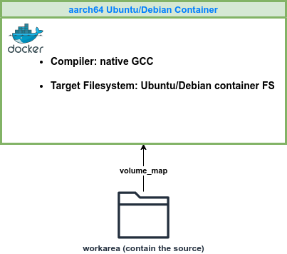

Vision-Apps Library Build in Ubuntu Docker Container
====================================================

Docker-based build system for vision_apps library (extendable to other PSDK-RTOS components). Supported use cases include:
- **Case 1**: Cross-compiling on x86_64 build machine in Ubuntu Docker container
- **Case 2**: Compiling with the native GCC in arm64v8 Ubuntu Docker container on x86_64 machine using QEMU
- **Case 3**: Compiling with the native GCC in arm64v8 Ubuntu Docker container directly on aarch64 build machine

<!-- <p float="left">
  
  <figcaption>CASE 1 in x86_64 Container</figcaption>
  
  <figcaption>CASE 2 and CASE 3 in aarch64 Container</figcaption>
</p> -->

<table>
  <tr>
    <td>
      
      <br>
      <center><em>CASE 1 with x86_64 Container</em></center>
    </td>
    <td>
      
      <br>
      <center><em>CASE 2 and CASE 3 with aarch64 Container</em></center>
    </td>
  </tr>
</table>

## Prerequisite

### docker-pull the base Docker image

Pull the Docker image needed. Assuming outside of a proxy network,
```bash
docker pull ubuntu:22.04
docker pull ubuntu:20.04
docker pull arm64v8/ubuntu:22.04
docker pull arm64v8/ubuntu:20.04
```

### repo tool

```bash
mkdir -p ~/bin
PATH="${HOME}/bin:${PATH}"
curl https://storage.googleapis.com/git-repo-downloads/repo > ~/bin/repo
chmod a+rx ~/bin/repo
sudo update-alternatives --install /usr/bin/python python /usr/bin/python3 1
```

Ensure that the following basic git configuration is complete, particularly for `repo init` to function as part of `init_setup.sh`.
```bash
git config --global user.name "Your Name"
git config --global user.email "you@example.com"
```

### edgeai-ti-proxy

Set up `edgeai-ti-proxy` ([repo link](https://bitbucket.itg.ti.com/projects/PROCESSOR-SDK-VISION/repos/edgeai-ti-proxy/browse))

Before docker-build or docker-run, please make sure sourcing `edgeai-ti-proxy/setup_proxy.sh`, which will define the `USE_PROXY` env variable and all the proxy settings for the TI network.

## CASE 1: Cross-compiling on x86_64 build machine in Ubuntu Docker container

Target for lib deployment: Yocto PSDK-Linux

This has the same goal as the PSDK-RTOS workarea build system except doing in Ubuntu Docker container.

### initial setup: install source repos and compiler tools

```bash
ARCH=amd64 UBUNTU_VER=22.04 SOC=j721e ./init_setup.sh
```

### Docker-build

```bash
ARCH=amd64 UBUNTU_VER=22.04 SOC=j721e ./docker_build.sh
```

### Docker-run

```bash
ARCH=amd64 UBUNTU_VER=22.04 SOC=j721e ./docker_run.sh
```

### Build in the container

```bash
make yocto_build
```

## CASE 2 & 3: Compiling with the native GCC in arm64v8 Ubuntu Docker container

Build systems:
1. In arm64v8 Ubuntu Docker container using QEMU on x86_64 machine
2. In arm64v8 Ubuntu Docker container on aarch64 target

Target for lib deployment:
1. arm64v8 Ubuntu 20.04 Docker container
2. arm64v8 Ubuntu 22.04 Docker container

### initial setup: install source repos

Depending on the Ubuntu distro for the target docker container, run one of these:
```bash
ARCH=arm64 UBUNTU_VER=22.04 SOC=j721e ./init_setup.sh
ARCH=arm64 UBUNTU_VER=20.04 SOC=j721e ./init_setup.sh
```

### Docker-build

(Only for CASE 2 - QEMU on x86_64 machine) to set up the QEMU (one-time after boot the build machine):
```bash
./qemu_init.sh
```

Depending on the Ubuntu distro for the target docker container, run one of these:
```bash
ARCH=arm64 UBUNTU_VER=22.04 SOC=j721e ./docker_build.sh
ARCH=arm64 UBUNTU_VER=20.04 SOC=j721e ./docker_build.sh
```

### Docker-run

Depending on the Ubuntu distro for the target docker container, run one of these:
```bash
ARCH=arm64 UBUNTU_VER=22.04 SOC=j721e ./docker_run.sh
ARCH=arm64 UBUNTU_VER=20.04 SOC=j721e ./docker_run.sh
```

### Build in the container

```bash
GCC_LINUX_ARM_ROOT=/usr CROSS_COMPILE_LINARO= LINUX_SYSROOT_ARM=/ LINUX_FS_PATH=/ TREAT_WARNINGS_AS_ERROR=0 make yocto_build
```

`vision_apps.so` location:
`${SOC}-workarea/vision_apps/out/J721E/A72/LINUX/release/libtivision_apps.so.<ver>`

## Workarounds and Fixes

### setup_psdk_rtos.sh

From `sdk_builder/scripts/setup_psdk_rtos.sh`, following scripts are extracted. In this project a couple of the scripts are selectively executed during `init_setup.sh`.

- `setup_tools_apt.sh`: this is now integrated into the Dockerfile.
- `setup_tools_arm.sh`
- `setup_tools_cgt.sh`
- `setup_tools_misc.sh`

### AR Flags
With the default Concerto compiler settings, the following warning messages show up around every static .a library.
```bash
/usr/bin/ar: `u' modifier ignored since `D' is the default (see `U')
```

A workaround: https://github.com/rsyslog/rsyslog/issues/1179
Update sdk_builder/concerto/compilers/gcc_linux_arm.mak to remove 'u' flag as follows:
```bash
$(_MODULE)_LINK_LIB   := $(AR) -rsc $($(_MODULE)_BIN) $($(_MODULE)_OBJS)
```

### Configuration for aarch64 Ubuntu container

- Following env variables are passed during docker-run:
    ```bash
    GCC_LINUX_ARM_ROOT=/usr CROSS_COMPILE_LINARO= LINUX_SYSROOT_ARM=/ LINUX_FS_PATH=/ TREAT_WARNINGS_AS_ERROR=0
    ```
- During docker-build:
    - `ti-rpmsg-char` is built and installed
    - apt-get install `libGLESv2`, `libEGL`, `libgbm`
- Additional library and include paths are added. Please see [`patches/sdk_builder/concerto/compilers/gcc_linux_arm.mak`](patches/sdk_builder/concerto/compilers/gcc_linux_arm.mak)
- A few missing header files are copied from targetfs right after docker-run. Please see [`entrypoint.sh`](entrypoint.sh).

## Trial Results

QEMU is slower than building directly on SK-AM69A.

| Target Ubuntu distro | Results  |
| -------------------- | -------- |
| Ubuntu 22.04         | vision_apps.so successfully built. |
| Ubuntu 20.04         | vision_apps.so successfully built. |


- Was able to build `vision_apps.so` and all the conformance tests defined in yocto_build rule in aarch64 Ubuntu 20.04 container on AM69A-SK board (the same thing should work using QEMU on x86_64 in Docker container).

- Resulting `vision_app.so` was verified in Ubuntu 20.04 container on TDA4VM-SK: `perf_stats` tool was built and run successfully (which was not possible when using vision_apps.so copied from Yocto target FS).

- Was able to build most of dependency in Robotics SDK ROS1 container except dl_infefer and gst_plugins as we do not yet have OS-RT libs built for the Ubuntu container.

